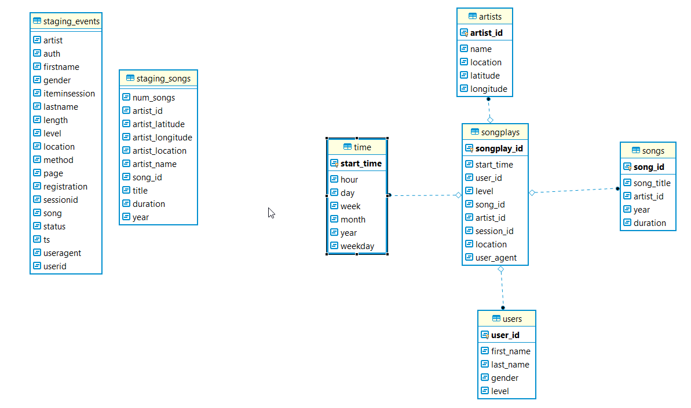
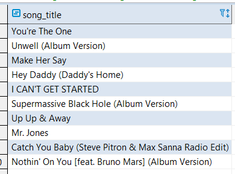
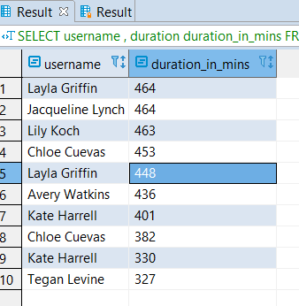

# DE-Project3-Cloud-DWH

#  ABOUT
This project is to support data analytics activity for a startup Sparkify. Sparkify has expanded their IT operations to 
cloud. Metadata about songs and user activity logs have been collected in S3. These metadata/logs are in json format. 
This project is build an ETL pipeline to move data from S3 buckets to Redshift tables.
 Data will be loaded to facts and dimension tables, which will be queried by analytics team 
 analyze user activity

# Database
This datawarehouse project is built on cloud. ALl logs files are stored in S3. 
Datawarehouse product used is Redshift. 
Tables are modelled after star schema as below:

## ER Diagram
   

## Fact Table
**songplays**
- table to store log data associated with song played by users.Only teh records associated with page NextSong are stored
- songplay_id, start_time, user_id, level, song_id, artist_id, session_id, location, user_agent

## Dimension Tables
**users** 
- table to store user information
- user_id, first_name, last_name, gender, level

**songs** 
- table to store songs information
- song_id, song_title, artist_id, year, duration

**artists**
- table to store srtists information 
- artist_id, name, location, latitude, longitude

**time**
- table to store start time information to do the necessary drill down on date/time
- start_time, hour, day, week, month, year, weekday

# How to run

- It is assumed that there is already a AWS redshift cluster  set up and running. It has a IAM Role to access S3.
  Required configurations are specified in dwh.cfg
  
- sql_queries.py has all the DDL/DML and COPY statements defined, which will be used by etl and create_tables modules.
   
- create_tables.py will create the database and tables. Run this script from terminal window before
  starting the ETL process. This also has DDL's to drop tables. Running this would remove any previously loaded data.
  
- etl.py will read all the log files in S3 and loads them to stage tables.

# Sample Analytics:

- __What are the top 10 songs listened by users? List in the order of popularity.__

   **SQL**
      
    SELECT song_title 
      FROM songs s , 
           ( SELECT song_id , count(1) 
               FROM songplays 
              WHERE song_id IS NOT NULL 
              GROUP BY song_id 
              ORDER BY count(1) DESC 
              LIMIT 10 
            ) f
     WHERE s.song_id = f.song_id 
     
     
   
   
   
 
- __What are the top 10 longest active session and user name for that session ?__

   **SQL**
      
    SELECT  username , duration duration_in_mins 
      FROM ( SELECT u.first_name || ' '|| u.last_name username , datediff( 'min', starttime ,endtime ) duration  
               FROM (SELECT session_id , user_id , ( timestamp 'epoch' + max(start_time) /1000 * interval '1 second')  endTime,  
                           ( timestamp 'epoch' + min(start_time) /1000 * interval '1 second') starttime 
                       FROM songplays  
                       GROUP BY session_id  , user_id 
                     ) d , users u 
              WHERE u.user_id = d.user_id
            ) 
     ORDER BY duration DESC 
     LIMIT 10
     
     
   
 
# Maintenance
- If there is a n need in future to add new tables or modify existingtable, sql_queries.py script needs to be modified.
  This has all the DDL/DML and SQL to do the required operation

- If any database connection needs to changed, it needs to be configured in cretae_tables.py
  
